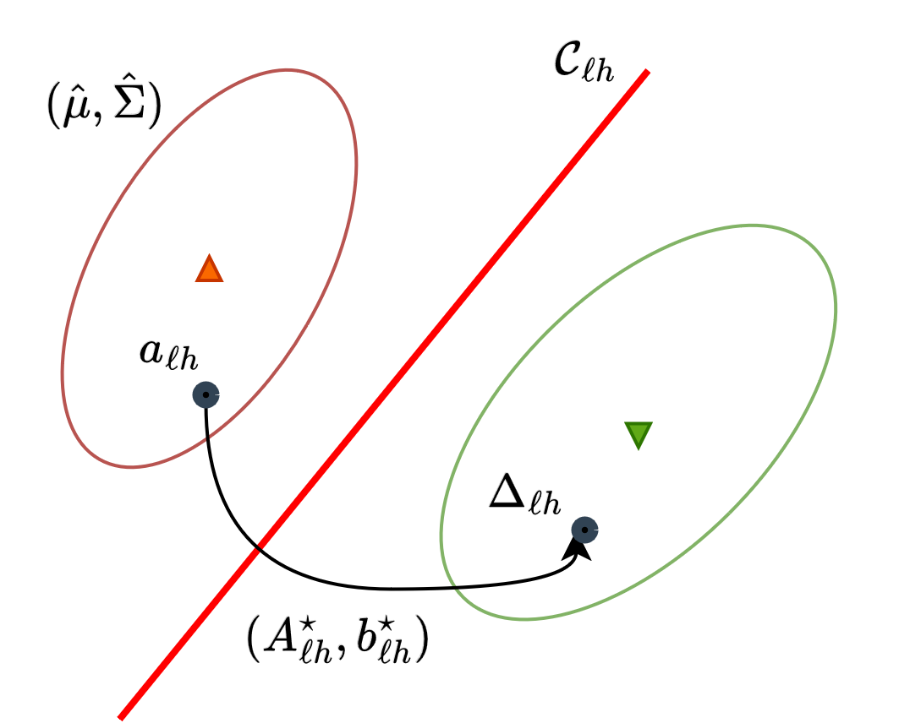

# Risk-Aware Distributional Intervention Policies for Language Models

<div  align="center">


<a  href="https://nguyenngocbaocmt02.github.io/"  target="_blank">Bao&nbsp;Nguyen</a> &emsp; <b>&middot;</b> &emsp;
<a  href="https://tbng.github.io/"  target="_blank">Binh&nbsp;Nguyen</a> &emsp; <b>&middot;</b> &emsp;
<a  href="https://duykhuongnguyen.github.io/"  target="_blank">Duy&nbsp;Nguyen</a> &emsp; <b>&middot;</b> &emsp;
<a  href="https://www.vietanhnguyen.net/"  target="_blank">Viet Anh&nbsp;Nguyen</a>
<br>
<a  href="https://arxiv.org/abs/2501.15758">[Paper]</a> &emsp;&emsp;

</div>

<br>

<div  align="center">



</div>


Language models are prone to occasionally undesirable generations, such as harmful or toxic content, despite their impressive capability to produce texts that appear accurate and coherent. This paper presents a new two-stage approach to detect and mitigate undesirable content generations by rectifying activations. First, we train an ensemble of layerwise classifiers to detect undesirable content using activations by minimizing a smooth surrogate of the risk-aware score. Then, for contents that are detected as undesirable, we propose layerwise distributional intervention policies that perturb the attention heads minimally while guaranteeing probabilistically the effectiveness of the intervention. Benchmarks on several language models and datasets show that our method outperforms baselines in reducing the generation of undesirable output.

Details regarding our methodology and the corresponding experimental results are available in [our following paper](https://arxiv.org/abs/2501.15758):


**Please CITE** our paper whenever utilizing this repository to generate published results or incorporate it into other software.

```bash
@article{nguyen2025radiant,
  title={Risk-Aware Distributional Intervention Policies for Language Models},
  author={Nguyen, Bao and Nguyen, Binh and Duy, Nguyen and Nguyen, Viet Anh},
  journal={arXiv preprint arXiv:2501.15758},
  year={2025}
}
```
